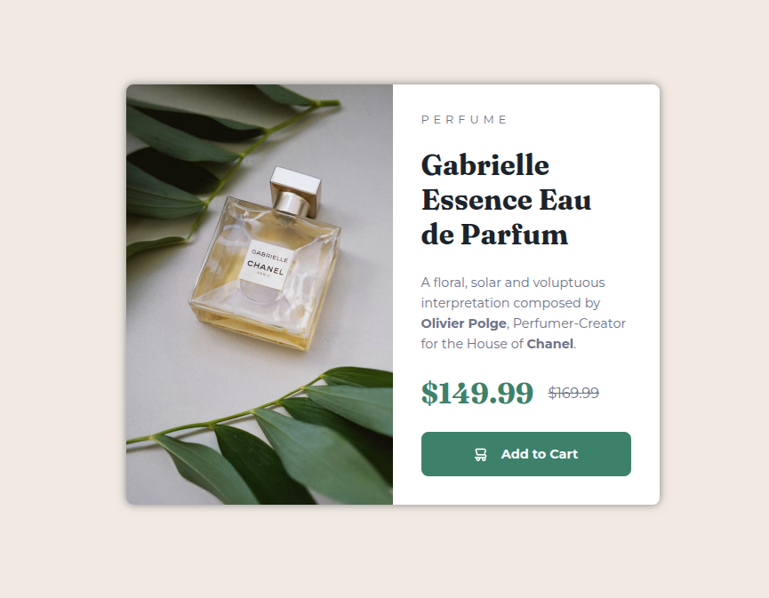
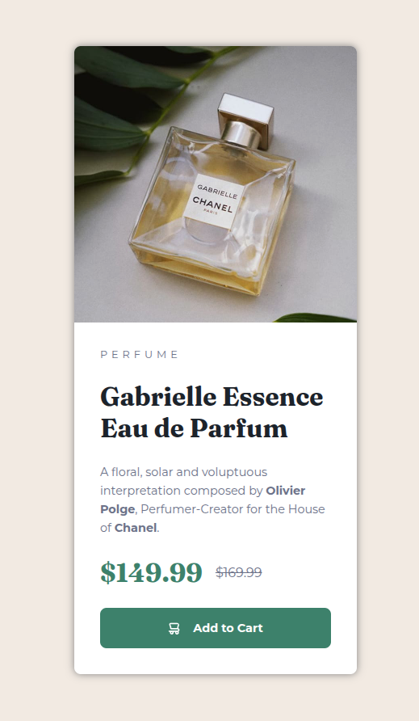

# Perfume card component

My second fully responsive HTML and CSS project! Feel free to give me a star 😄
 
It features a responsive perfume e-commerce card. With version for desktop, tablet and mobile.
 
I was able to use two different **google-fonts**, **variables**, **media-queries**, **flex-box** and **grid**.

---

## 📸 Preview

### Desktop

### Mobile

## 

## How to use and customize

1. Clone the repo

`git clone https://github.com/rodrigodvalente/perfume-card.git`

2. Navigate to the directory

`cd perfume-card`

3. Open the `index.html` and customize in your code editor of preference

---

## 🧠 Best practices

It features **variables**, **:hover**, **BEM**, **media-queries**

I also used Prettier to make the layout better on **VSCode** and used the command line for versioning with Git.
